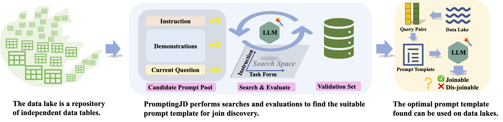
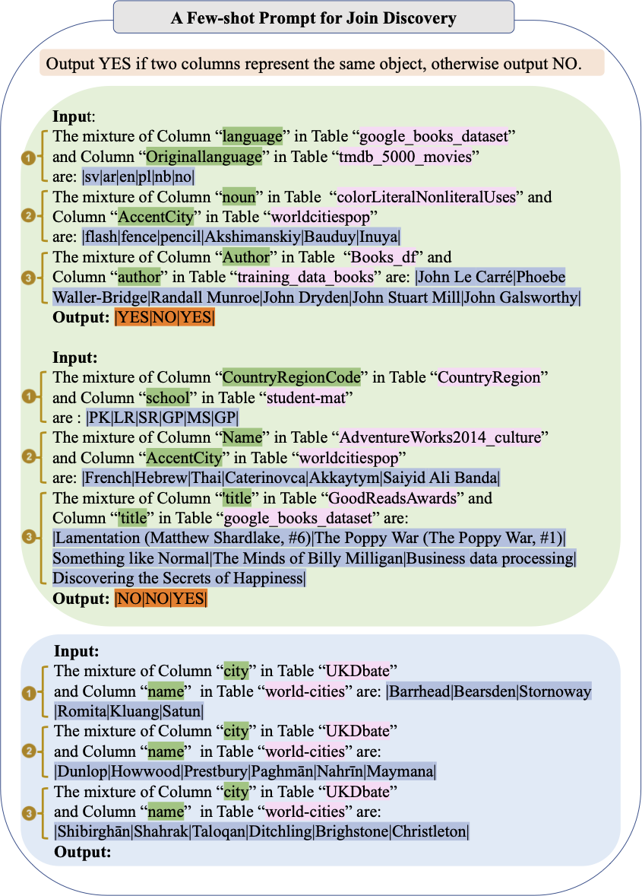
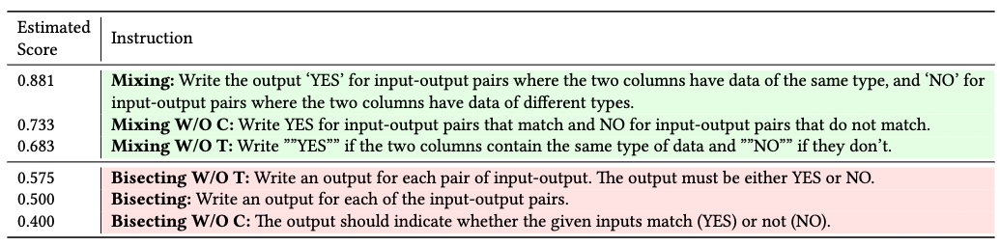
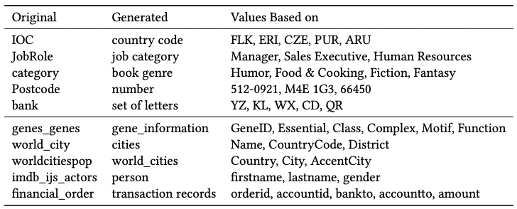
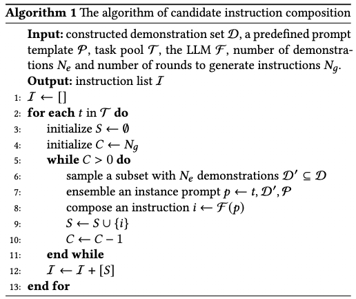
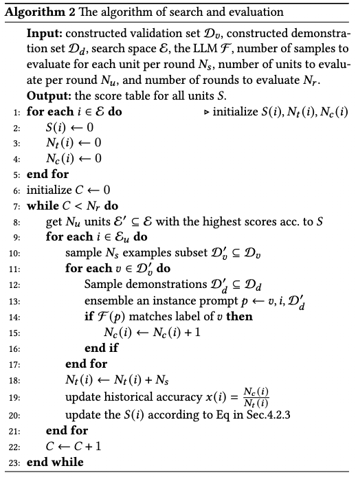

# Language Models are Explorers for Join Discovery on Data Lakes

#### VLDB 2024 submission

###### <a href="" target="_blank">Yaohua Wang</a>1, <a href="" target="_blank">Bolin Ding</a>1, <a href="" target="_blank">Haibin Wang</a>1, <a href="" target="_blank">Rong Zhu</a>1, <a href="" target="_blank">Zhijian Ma</a>1, <a href="" target="_blank">Biqing Huang</a>2, <a href="" target="_blank">Jingren Zhou</a>1

1DAMO Academy, Alibaba Group    2Tsinghua
University  

------------------------------------------------------------------------

## Abstract

------------------------------------------------------------------------

###### TL;DR: **JD-SCOPE** is a novel system for join discovery on data lakes with LLMs.

  

  

Join discovery is a typical task in data lake research. It finds
joinable relationships between columns of different tables which is
critical for data integration in schema-less data lakes. On the other
hand, LLMs have achieved promising results in many natural language
tasks recently. They behave well with the in-context learning ability
that only needs a few examples and no fine-tuning, showing great
advantages that can be applied to join discovery. However, directly
applying the prompt generation methods in NLP will cause a migration
problem. It means that strategies useful in NLP scenarios cannot be used
in data lakes or obtain limited efficacy, leading to sub-optimal
prompts. This is because of the differences in the task definition, data
modalities and the availability of labeled samples between the two
scenarios. The unsuitable prompts not only fail to inspire the superior
ability of LLMs but even mislead LLMs to output incorrect results,
leading to performance degradation. Therefore, a novel **J**oin
**D**iscovery **S**ystem with **C**omprehensive and **O**ptimized
**P**rompt **E**ngineering (**JD-SCOPE**) is proposed to deal with join
discovery on data lakes. It first constructs unsupervised examples for
demonstrations of the prompt and the validation set for hyper-parameters
tuning. Then it explores the prompt template automatically. Meanwhile,
JD-SCOPE also ensures stable outputs of LLMs, thus avoiding the impact
of randomness. In addition, JD-SCOPE can be extended to semantic join
discovery to explore column pairs that are conceptually correlated but
not identical (e.g., *country code* and *language code*) for a
comprehension understanding of data. JD-SCOPE paves a way to ground data
lakes with LLMs and harnesses the knowledge and logical reasoning power
of LLMs for join discovery. To evaluate join discovery effectively, the
JD-Lake dataset is curated and benchmarked with baselines and a series
of popular LLMs. The experiments prove that JD-SCOPE alleviates this
migration problem well and empirically outperforms alternatives, showing
the superiority of JD-SCOPE.

  

## What the final prompt template looks like

------------------------------------------------------------------------

An illustration of a two-shot single prompt multiple discriminations
style prompt in Mixing Form with Md=3. First, all the current questions
and demonstrations are put into a single prompt to reduce complexity. It
can reduce the number of prompt builds and LLM calls to 1. In
consequence, it need not collect and manage the outputs of multiple
calls of LLMs, because the output of this prompt is a sequence of
discriminations. Second, a single prompt means a single inference time
in theory. Also, it only needs 1 instruction and saves Md − 1
instruction tokens compared with the basic version. The token number
saved is proportional to the dataset size. The larger the dataset size
is, the more tokens are saved in this way. The form is called Single
Prompt Multiple Discriminations Style (S-M Style), which increases the
scalability of JD-SCOPE. Last, together with more demonstrations, the
multiple current questions of the candidate column pairs provide a
richer context in the prompt. The LLMs can see more comprehensive
information and then output more stable results for each question which
is insensitive to thresholds. Therefore, the prompt in Fig. 3 (III) in
the paper evolves into the improved version form in the Figure above.

  

## The instructions found and their estimated scores by JD-SCOPE

------------------------------------------------------------------------

------------------------------------------------------------------------

The retrieved instructions with high and low estimated scores in the
search and evaluation phase are picked and shown in the table above. It
can be seen that the instructions with high estimated scores (green
background) share the advantage of clear, precise and detailed
statements, while the low score instructions (pink background) are
ambiguous and rough. The SoTA JD-SCOPE uses the instruction of
0.881 in the *Mixing Form*, proving
this task form is the most consistent with the thinking logic of LLMs
for this task and dataset.

  

## Generated examples of column name and table caption by JD-SCOPE

------------------------------------------------------------------------

------------------------------------------------------------------------

The *Metadate Generation* is qualitatively analyzed in the table above.
The generated column names are shown in the first block. The original
columns “IOC", “JobRole", and “category" can be nicely summarized as
“country code", “job category" and “book gere" respectively according to
the cell values shown in column *Values Based on*. However, columns
“Postcode" and “bank" are summarized as “number" and “set of letters",
which lost the key information, revealing the deficiencies in the
knowledge ability of LLMs. The generated table captions are in the
second block. Similarly, some tables (e.g., “genes_genes", “world_city"
and “worldcitiespop" ) can also be well summarized, and others (e.g.,
“imdb_ijs_actors", “financial_order") are poorly summarized and not
informative enough. The generated metadata improves the join discovery
by adding extra information. This ability comes from the fact that LLMs
have seen massive amounts of corpus during the training phase, and this
capability has been skillfully applied to the join discovery task.

  

## The Algorithmic pseudo-code of JD-SCOPE

The algorithm of *Candidate Instruction Composition* of Section 4.2.3 to
generate candidate instruction is described in detail in Algorithm 1.
The algorithm of *Search and Evaluation* of Section 4.2.3 to find the
optimal instruction and task form is shown in Algorithm 2.

  

------------------------------------------------------------------------

